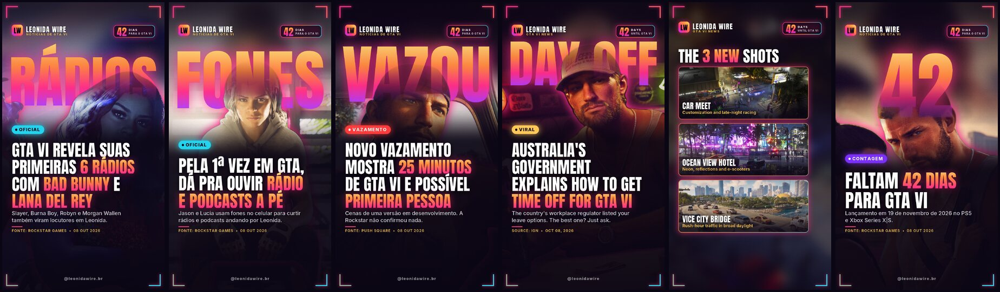
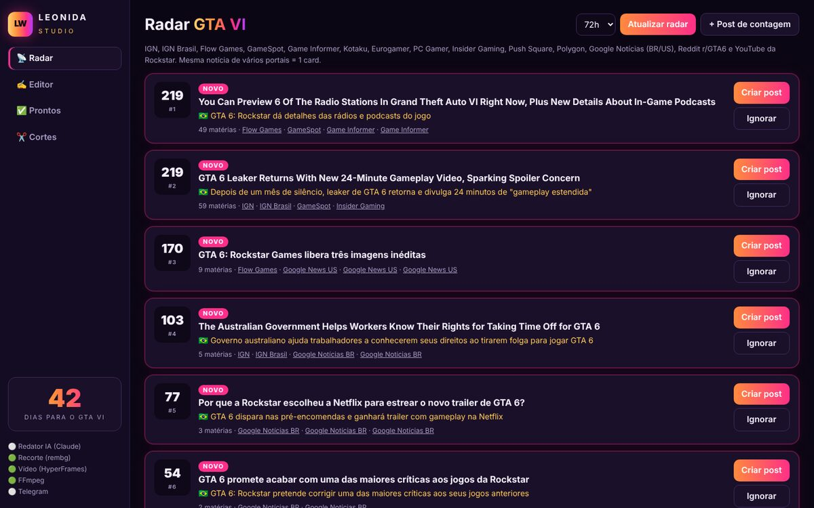
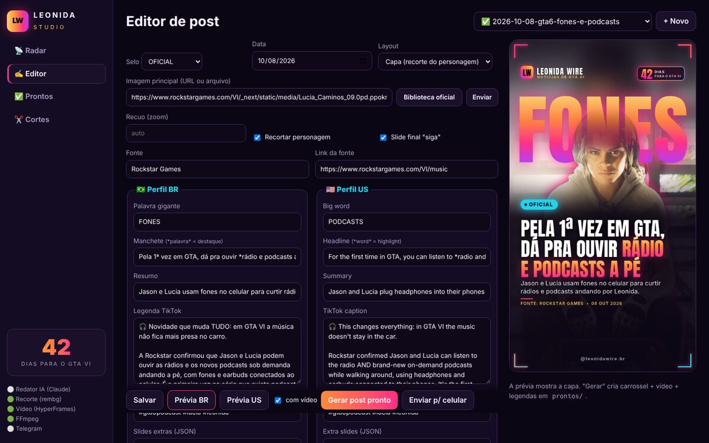

# 🌴 Leonida Studio — notícias de GTA VI prontas para o TikTok (BR + US)

Fábrica de posts de **GTA VI**: monitora os portais de games, encontra a notícia nova, escreve em
**português e inglês**, gera a **arte 9:16**, o **carrossel**, um **vídeo animado** e a **legenda** —
tudo pronto para você só baixar e postar no perfil brasileiro e no americano.

**👉 Posts prontos:** [`prontos/`](prontos/) · Radar ao vivo: [`prontos/RADAR.md`](prontos/RADAR.md)

| | |
|---|---|
| 📡 **Radar** | IGN, IGN Brasil, Flow Games, TecMundo/Voxel, GameSpot, Game Informer, Kotaku, Eurogamer, PC Gamer, Push Square, Insider Gaming, Polygon, Google Notícias, Reddit r/GTA6 e YouTube da Rockstar. Junta a mesma notícia de vários sites e ranqueia por relevância. |
| 🎨 **Estilo próprio** | Paleta "Vice" (pôr do sol de Leonida), palavra gigante **atrás do personagem recortado**, manchete com destaque em gradiente, cantos neon, contador "X dias para o GTA VI". |
| 🎬 **Vídeo** | Capa animada de 8 s (HyperFrames + GSAP): flash, palavra entrando, personagem subindo, manchete linha a linha — com a **música tema** de fundo. |
| 🎥 **Edição por link** | Mande um link: o app acha as cenas, reenquadra 9:16 no personagem e aplica movimentos de câmera estilo Higgsfield (crash zoom, dolly, câmera na mão, whip pan, câmera lenta) no HyperFrames, com grão de filme, marca e manchete BR/US. |
| ✂️ **Cortes** | Trailer/gameplay/vídeo viral (baixado com **yt-dlp**) → corte 9:16 com fundo desfocado, moldura da marca, música tema por baixo e legenda automática. |
| ✍️ **Redação** | O Codex/Claude escreve no seu PC (veja `AGENTS.md`) ou o Claude API escreve sozinho na nuvem. |
| 📲 **Entrega** | Pasta pronta por post + galeria com botão "copiar legenda" + envio opcional no Telegram/Discord. |

## Como fica



O app (`python -m leonida serve`):

| Radar | Editor com prévia |
|---|---|
|  |  |

Cada post vira uma pasta:

```
prontos/2026-10-08/2026-10-08-gta6-radios-reveladas/
├── br/  01_capa.png  02_as-6-radios-de-leonida.png  03_o-que-sabemos.png  04_siga.png  video.mp4  legenda.txt
├── us/  01_cover.png 02_leonidas-first-6-stations.png 03_what-we-know.png 04_follow.png video.mp4  caption.txt
└── README.md   ← abre no GitHub mostrando tudo
```

## Instalação no PC (Windows)

1. Instale **Python 3.11+** (marque "Add to PATH"), **Node.js 22+** e **FFmpeg**:
   ```powershell
   winget install Python.Python.3.12 OpenJS.NodeJS.LTS Gyan.FFmpeg
   ```
2. Clone e instale:
   ```powershell
   git clone https://github.com/EDIMILSONDACUNHANOGUEIRA/sw-codex.git
   cd sw-codex
   python -m venv .venv; .venv\Scripts\activate
   pip install -r requirements.txt
   ```
3. Abra o app: `python -m leonida serve` → **http://localhost:8000**
   (ou dois cliques em `scripts\abrir-studio.bat`)
4. (Opcional) Radar automático no próprio PC, de hora em hora:
   `powershell -ExecutionPolicy Bypass -File scripts\agendar-windows.ps1`

(macOS/Linux: `brew install python node ffmpeg` ou `apt install ffmpeg nodejs`, e `source .venv/bin/activate`.)

> Na primeira vez o recorte de personagem baixa um modelo de ~170 MB e o vídeo baixa o Chrome do
> HyperFrames. Depois fica tudo local.

## Usando com o Codex (ou Claude Code)

Abra a pasta no Codex e peça, por exemplo:

- *"Faz os posts de hoje"* → ele roda o radar, confere as fontes, escreve BR+US e gera tudo.
- *"Cria o post da notícia 2 do radar"*
- *"Faz um corte do trailer de 1:12 a 1:24 com a manchete 'Jason em primeira pessoa'"*

As regras de redação, o estilo e o formato dos arquivos estão no [`AGENTS.md`](AGENTS.md).

## Comandos

```bash
python -m leonida radar                  # notícias do momento (ranking)
python -m leonida rascunho 1             # cria posts/<id>/post.yaml da notícia nº 1
python -m leonida build <post-id>        # gera capa + carrossel + vídeo + legendas (BR e US)
python -m leonida build <post-id> --sem-video   # rápido, só imagens
python -m leonida contagem               # post "faltam X dias" com screenshot oficial
python -m leonida corte URL 0:42 1:05 --pt "Manchete *destaque*" --en "Headline *highlight*" --credito "Rockstar Games"
python -m leonida editar URL --pt "Manchete *BR*" --en "Headline *US*"   # edição 9:16 estilo Higgsfield
python -m leonida musica URL --inicio 0:12 --nome trailer-1   # música tema (obrigatória)
python -m leonida auto                   # radar → redação (Claude) → render → envio
python -m leonida galeria                # atualiza prontos/index.html
python -m leonida serve                  # app web
```

## 🎵 Música tema em todas as publicações (obrigatório)

Todo post sai com a **música tema de GTA VI**, nunca com música aleatória. Como a API do TikTok não
deixa escolher a música de um post de fotos, o carrossel é publicado como **vídeo**
(`prontos/<data>/<post>/br/tiktok/post.mp4`): a capa e os slides em sequência, com a música tema
embutida. A "música automática" do TikTok fica sempre desligada.

Baixe as músicas uma vez no seu PC (link do trailer oficial no YouTube e o segundo em que a música começa).
Pode ter mais de uma; o app alterna entre elas, uma por post:

```bash
python -m leonida musica "https://www.youtube.com/watch?v=..." --inicio 0:12 --nome trailer-1
python -m leonida musica "https://www.youtube.com/watch?v=..." --inicio 0:05 --nome trailer-2
python -m leonida musica --arquivo tema.mp3 --nome minha-faixa   # se já tiver o arquivo
python -m leonida musica --listar
```

Os arquivos ficam só no seu PC (`assets/music/`, fora do GitHub). **Sem nenhuma música tema, o vídeo do
post não é gerado e nada é publicado automaticamente.** Os cortes e edições de vídeo também recebem a
música por baixo do áudio original (volumes em `config/brand.yaml → music`).

> ⚠️ A música dos trailers é protegida por direitos autorais e o TikTok pode silenciar um vídeo. Se
> acontecer, poste o mesmo vídeo à mão e escolha o **som oficial do trailer de GTA VI na biblioteca do
> TikTok**, nunca um som aleatório.

## ⬇️ Vídeos do YouTube (yt-dlp)

Os cortes usam o [**yt-dlp**](https://github.com/yt-dlp/yt-dlp) — o sucessor do youtube-dl, o
repositório mais usado para baixar vídeos do YouTube (também X/Twitter, Reddit, TikTok, Twitch…).
Já vem no `requirements.txt` com o componente de JavaScript que o YouTube passou a exigir, e usa o
Node.js que você instalou. Se o YouTube pedir login ("confirm you're not a bot"), rode antes:

```powershell
$env:LEONIDA_YTDLP_BROWSER="chrome"   # usa os cookies do seu navegador (chrome, edge, firefox)
```

## 🔍 Qualidade de imagem

- **Sem cara de IA:** nada de contorno neon no personagem. Ele projeta sombra na palavra gigante, a
  luz do fundo invade a borda do recorte, a máscara segue o cabelo, e a arte inteira ganha grão de
  filme e halação. Ajuste em `config/brand.yaml → acabamento` (`neon: true` volta ao visual antigo).

- Artes em **1080×1920** (máximo do TikTok para fotos), PNG sem perda, com nitidez aplicada.
- Fotos pequenas (ex.: imagem de matéria em 1280×720) são ampliadas antes do recorte. Para upscale
  **com IA**, baixe o `realesrgan-ncnn-vulkan` nos Releases do
  [Real-ESRGAN](https://github.com/xinntao/Real-ESRGAN) e coloque no PATH (ou defina `REALESRGAN_BIN`).
- O redator automático só aceita imagem de matéria com ≥ 1600 px; senão usa screenshot oficial em 4K.
- Vídeos em qualidade alta, 12 Mbps (`LEONIDA_VIDEO_BITRATE` para mudar).

## Automático 24h (GitHub Actions)

Já configurado em `.github/workflows/`:

- **radar.yml** — a cada 2 h procura notícia nova. Com `ANTHROPIC_API_KEY` ele escreve, gera e te envia
  o post pronto; sem a chave, te manda um alerta "notícia nova" para pedir ao Codex.
- **contagem.yml** — todo dia às 07:52 (Brasília) gera o post "faltam X dias".
- **pages.yml** — publica a galeria `prontos/` no GitHub Pages para você revisar no celular.

Configure em **Settings → Secrets and variables → Actions**:

| Secret | Para quê |
|---|---|
| `TELEGRAM_BOT_TOKEN` / `TELEGRAM_CHAT_ID` | Receber as artes, o vídeo e a legenda no Telegram (crie o bot no @BotFather; o chat id vem do @userinfobot). |
| `DISCORD_WEBHOOK_URL` | (opcional) mesma coisa num canal do Discord. |
| `ANTHROPIC_API_KEY` | (opcional) redação automática com Claude. |

E em **Settings → Pages → Source: GitHub Actions** para a galeria.

## Personalizar

- `config/brand.yaml` — nome da marca, @ dos perfis BR/US, paleta, selos, áreas seguras do TikTok.
- `config/sources.yaml` — portais monitorados, palavras que dão prioridade.
- Detalhes técnicos e repositórios usados: [`docs/REPOS.md`](docs/REPOS.md).

## Direitos e boas práticas

As imagens usadas são screenshots e artes **oficiais divulgadas pela Rockstar Games** para imprensa e fãs,
sempre com crédito. Nos cortes, use trechos curtos com comentário/edição própria e crédito ao autor.
Não publique material vazado nem conteúdo explícito. GTA VI e todas as marcas pertencem à Rockstar
Games/Take-Two; este projeto não é afiliado a elas.
