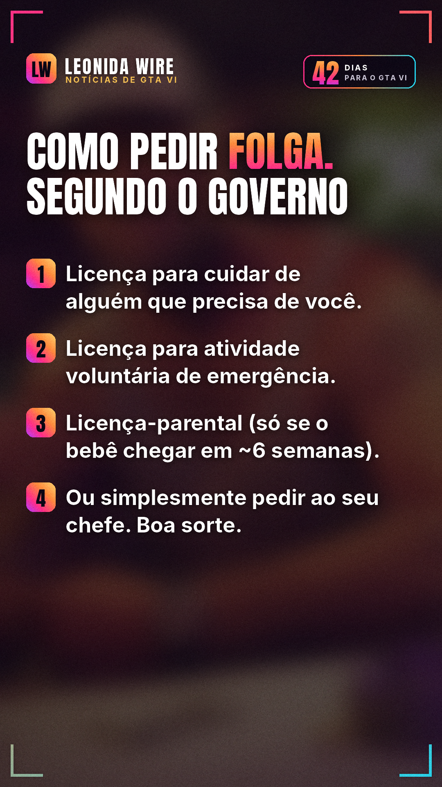

# Governo da Austrália ensina como pedir folga pra jogar GTA VI

Fonte: [IGN](https://www.ign.com/articles/australian-government-time-off-gta-6)

## 🇧🇷 Perfil BR

   

```
😂 Isso é real: o Fair Work Ombudsman, órgão trabalhista do governo australiano, postou um guia de como tirar folga no lançamento de GTA VI.

As opções de licença não remunerada listadas:
1. Cuidar de alguém que precisa de você
2. Atividade voluntária de emergência
3. Licença-parental (o bebê teria que nascer em ~6 semanas 💀)
4. Simplesmente pedir pro chefe

Spoiler: a 4ª é a única que funciona. Você vai faltar no dia 19/11? 👇

Fonte: IGN

#gta6meme #folga #australia #gta6 #gtavi #gta6brasil #rockstargames #noticiasgamer
```
