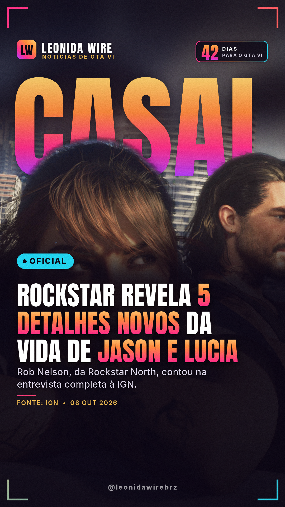
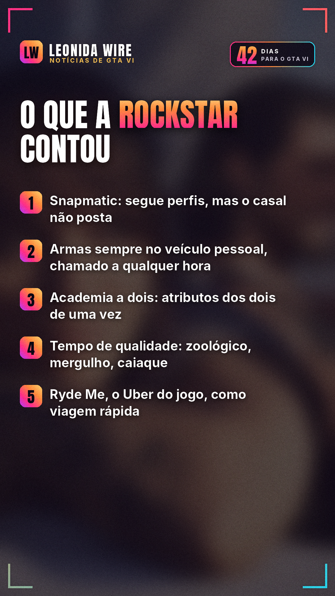

# Rockstar revela 5 detalhes novos da vida de Jason e Lucia

Fonte: [IGN](https://www.ign.com/articles/gta-6-the-big-interview)

## 🇧🇷 Perfil BR

  

```
📱 A Rockstar contou detalhes novos de GTA VI na entrevista completa de Rob Nelson à IGN.

Snapmatic: dá pra seguir perfis, mas Jason e Lucia não postam. "Vocês são um casal em fuga, só espiam."
Todas as armas compradas ficam no veículo pessoal, que você chama a qualquer hora.
Academia a dois: treinando juntos, os dois cuidam dos atributos de uma vez.
Tempo de qualidade: zoológico, mergulho, paraquedas, caiaque, passeio de mãos dadas e até assalto juntos.
Ryde Me, o "Uber" do jogo, é um jeito de fazer viagem rápida.

Qual desses você vai testar primeiro? 👇

#jasonelucia #vicecity #gta6gameplay #gta6 #gtavi #gta6brasil #rockstargames #noticiasgamer
```
