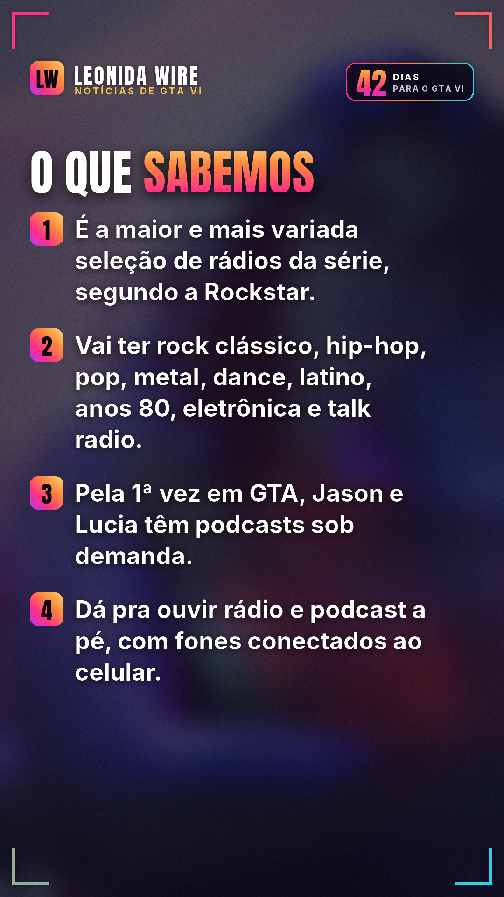

# GTA VI revela suas primeiras 6 rádios com Bad Bunny e Lana Del Rey

Fonte: [Rockstar Games](https://www.rockstargames.com/VI/music)

## 🇧🇷 Perfil BR

    

```
🎧 A Rockstar revelou as primeiras 6 rádios de GTA VI — e o line-up tá INSANO.

📻 Cocoteo FM (latino) — Bad Bunny e RaiNao
📻 Flash FM (pop) — Robyn e Alex Consani
📻 Back Country Radio (country) — Lana Del Rey e Morgan Wallen
📻 The Chamber 106.6 (metal) — Kerry King e Tom Araya, do Slayer
📻 AfroBank FM (música africana) — Burna Boy e Palms Trax
📻 Dirty South Classics (rap) — Trick Daddy e Trina

As prévias já estão no site oficial da Rockstar. Qual vai ser a sua rádio fixa em Leonida? 👇

Fonte: Rockstar Games

#gta6radio #badbunny #lanadelrey #vicecity #gta6 #gtavi #gta6brasil #rockstargames #noticiasgamer
```
