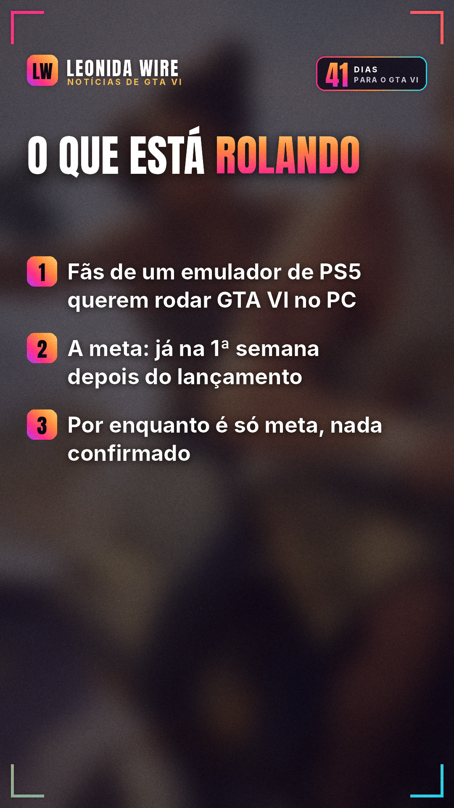
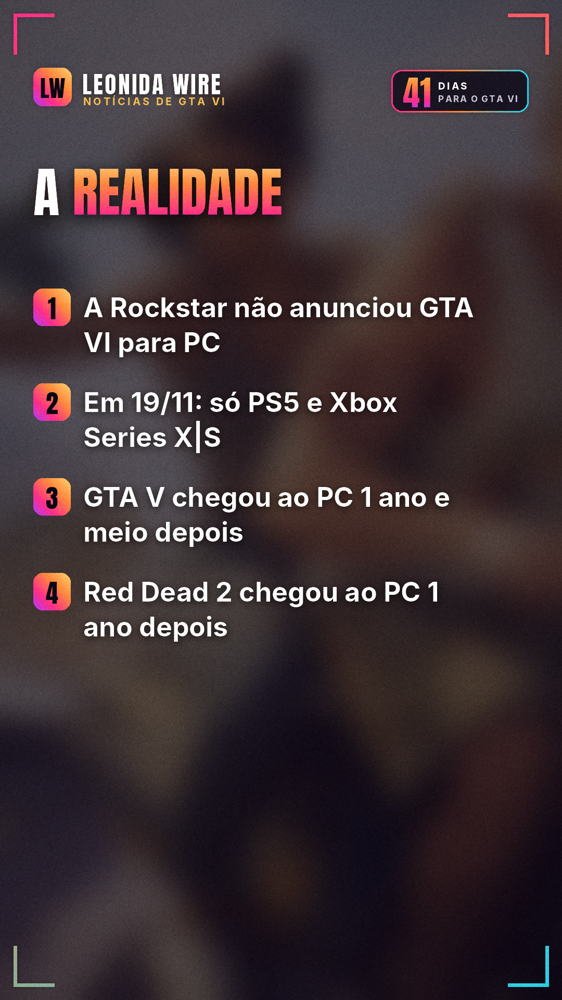

# Emulador de PS5 vai rodar GTA VI no PC? Calma

Fonte: [iXBT Games](https://ixbt.games/en/news/2026/10/05/440253-entuziasty-xotiat-zapustit-gta-vi-na-pc-srazu-posle-reliza-s-pomoshhiu-emuliatora-ps5.html)

## 🇧🇷 Perfil BR

     

```
💻 Vai dar pra jogar GTA VI no PC com emulador de PS5? Calma.

Fãs que desenvolvem um emulador de PS5 colocaram como meta rodar GTA VI no computador já na primeira semana depois do lançamento. Mas, por enquanto, é só uma meta, sem nada confirmado.

A Rockstar não anunciou GTA VI para PC. O jogo sai em 19/11 só para PS5 e Xbox Series X|S.

Na história da Rockstar, o PC vem depois: GTA V chegou ao computador 1 ano e meio após o console, e Red Dead Redemption 2, 1 ano depois.

⚠️ Cuidado: site prometendo "GTA 6 para PC" é golpe. Empresas de segurança já acharam instaladores falsos com vírus que roubam senhas.

Você espera a versão de PC ou joga no console? 👇

Fonte: iXBT Games

#gta6pc #emulador #golpe #gta6 #gtavi #gta6brasil #rockstargames #noticiasgamer
```
