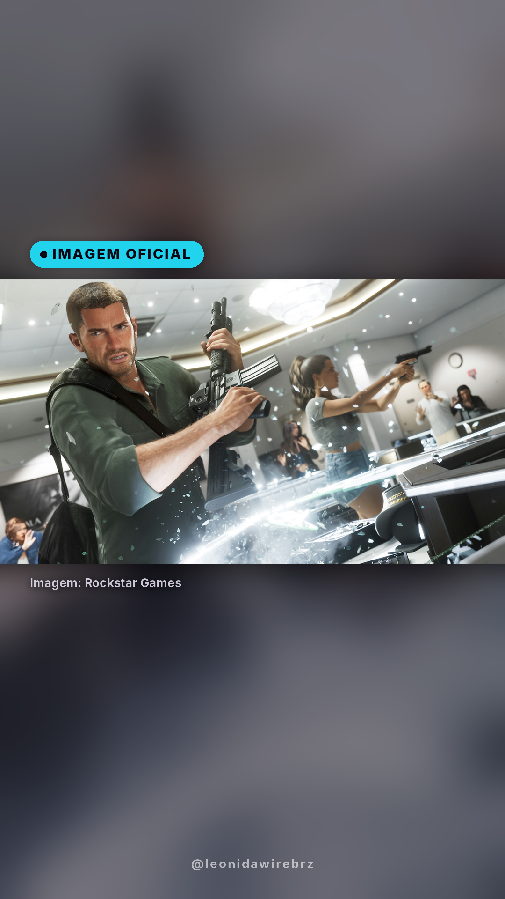
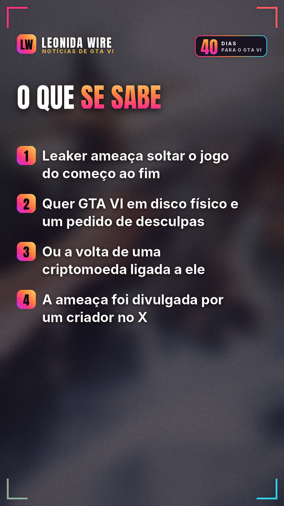
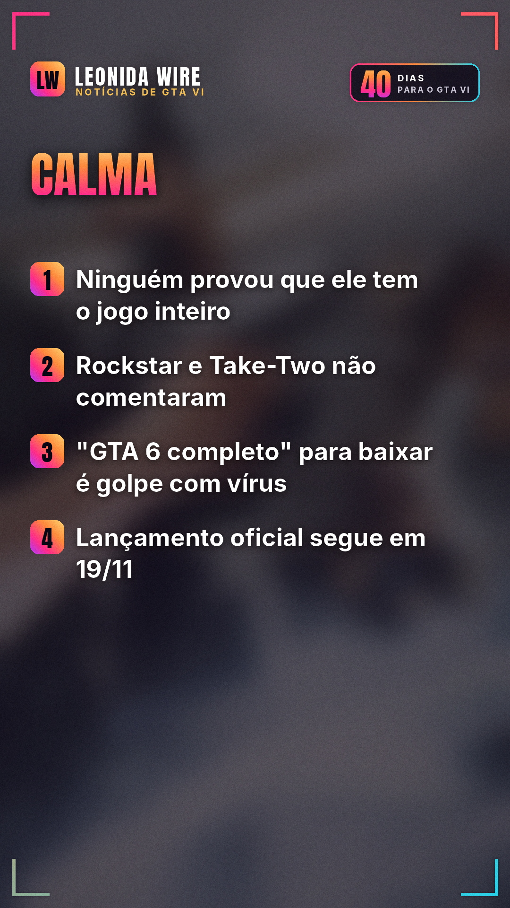

# Leaker ameaça soltar GTA VI completo antes do lançamento

Fonte: [Dexerto](https://www.dexerto.com/gta/gta-6-leaker-cyberleek-threatens-to-release-playable-build-from-start-to-finish-3417786/)

## 🇧🇷 Perfil BR

    

```
🚨 O leaker Cyberleek estaria ameaçando soltar GTA VI completo, jogável do começo ao fim, antes do lançamento.

A informação é de um criador de conteúdo no X e foi repercutida pelo Dexerto. As condições seriam a Take-Two lançar o jogo em disco físico e pedir desculpas publicamente, ou a volta de uma criptomoeda ligada ao leaker.

⚠️ Nada disso foi confirmado: ninguém provou que ele tem o jogo inteiro, e a Rockstar não comentou.

Cuidado: já circulam downloads falsos de "GTA 6 completo" com vírus que roubam senhas. Não baixe nada.

GTA VI chega oficialmente em 19/11.

Você acha que é blefe? 👇

#gta6leak #cyberleek #golpe #gta6 #gtavi #gta6brasil #rockstargames #noticiasgamer
```
