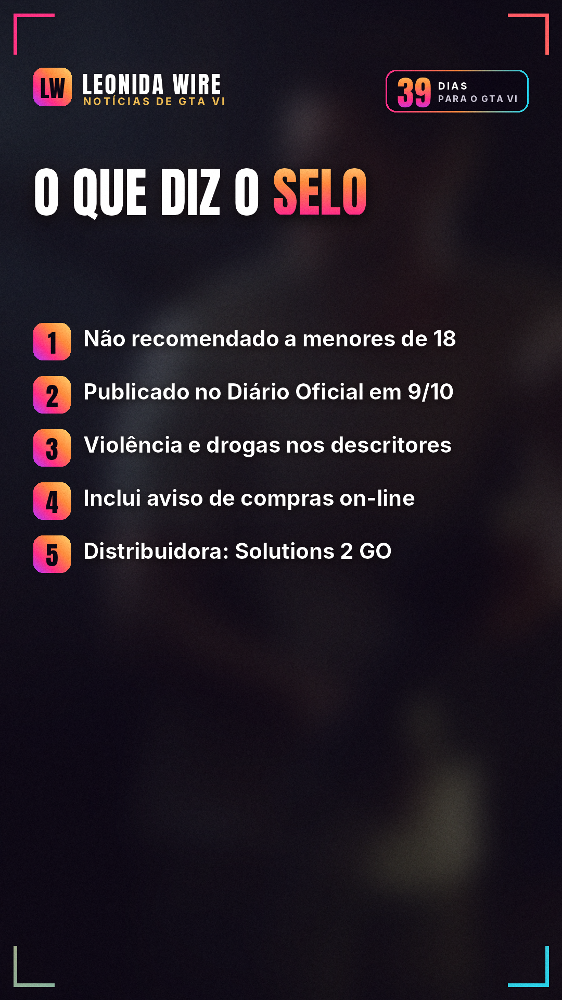

# GTA VI é oficialmente 18 anos no Brasil

Fonte: [Diário Oficial da União](https://www.in.gov.br/web/dou/-/portaria-cgpcind/dsprad/sedigi-n-2.095-de-8-de-outubro-de-2026-737473413)

## 🇧🇷 Perfil BR

   

```
🚨 É oficial: GTA VI é 18 anos no Brasil.

O Ministério da Justiça classificou o jogo como "não recomendado para menores de 18 anos". A portaria saiu no Diário Oficial da União em 9/10.

Descritores do selo: violência, drogas, linguagem imprópria e conteúdo sexual.

Elementos interativos: compras on-line e conteúdo adulto.

A distribuidora oficial no Brasil é a Solutions 2 GO. Até o começo de outubro, as lojas digitais mostravam a classificação brasileira como pendente.

GTA VI chega em 19/11 para PS5 e Xbox Series X|S.

Alguém esperava menos que 18? 👇

#classificacaoindicativa #gta6brasil #rockstargames #gta6 #gtavi #noticiasgamer
```
