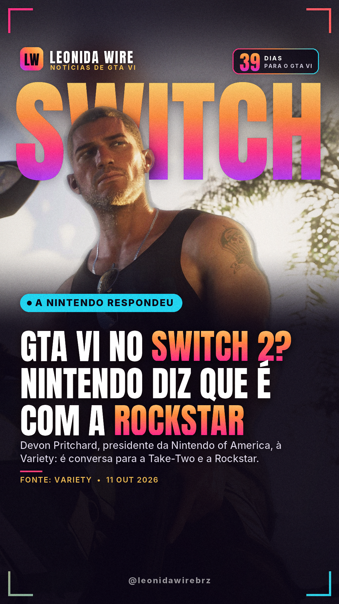
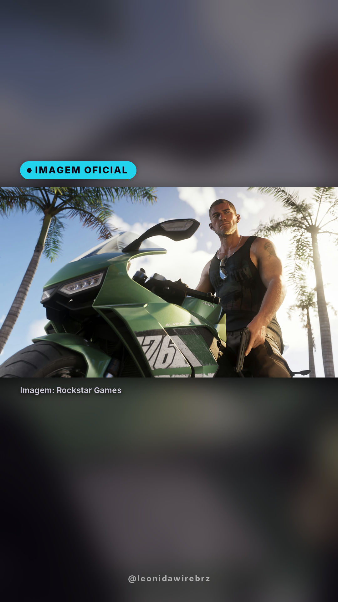
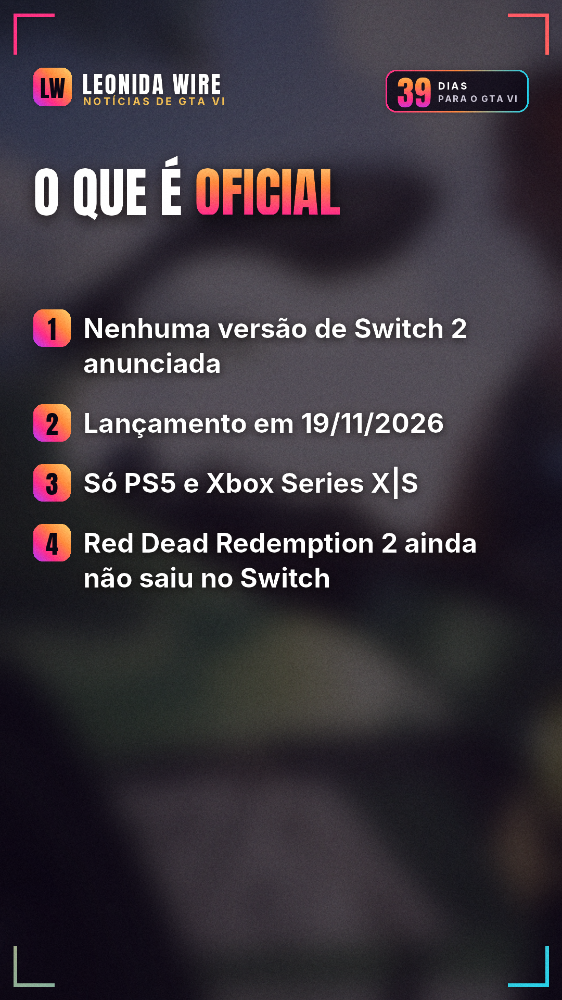

# GTA VI no Switch 2? Nintendo diz que é com a Rockstar

Fonte: [Variety](https://variety.com/2026/gaming/news/legend-of-zelda-movie-gta-6-nintendo-devon-pritchard-interview-1236906466/)

## 🇧🇷 Perfil BR

    

```
🎮 GTA VI no Switch 2? A Nintendo respondeu.

Devon Pritchard, presidente da Nintendo of America, foi perguntada sobre isso em entrevista à Variety.

A resposta: "Essa vai ser uma conversa para a Take-Two e a Rockstar, mas não tenho nada a anunciar da minha parte neste momento."

Ou seja: nenhuma versão de Switch 2 foi anunciada. Red Dead Redemption 2 também ainda não saiu no Switch.

GTA VI chega em 19/11 só no PS5 e no Xbox Series X|S.

Você jogaria GTA VI no Switch 2? 👇

#nintendoswitch2 #gta6switch2 #nintendo #gta6 #gtavi #gta6brasil #rockstargames #noticiasgamer
```
